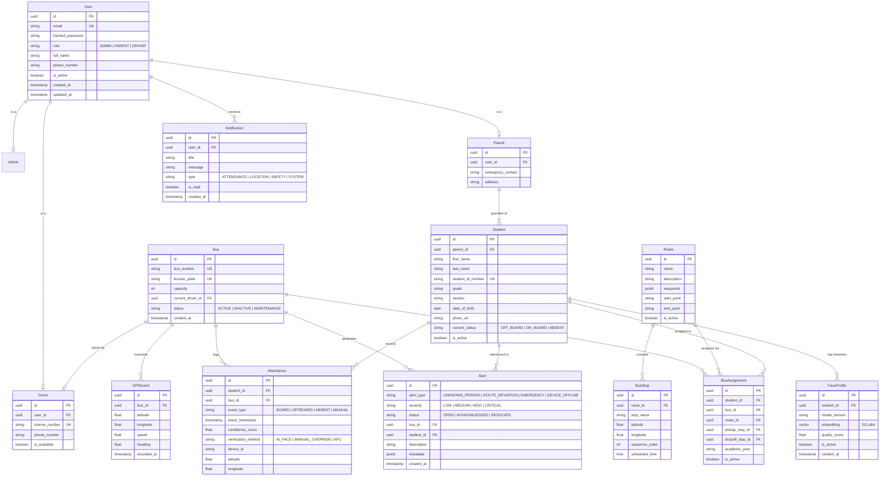

# Database Design & Entity-Relationship Specification

## 1. Database Principles

- **Primary Keys**: UUID v4 / BigInt for high scalability and secure references.
- **Auditability**: All primary tables feature `created_at` and `updated_at` UTC timestamps.
- **Referential Integrity**: Foreign keys enforce cascade or restrict policies appropriately.
- **Vector Support**: `pgvector` extension for indexing 512-dim facial embeddings with HNSW indexing.
- **Soft Deletion**: `is_active` / `deleted_at` flags where historical tracking is essential.

---

## 2. Mermaid Entity-Relationship Diagram (ERD)

